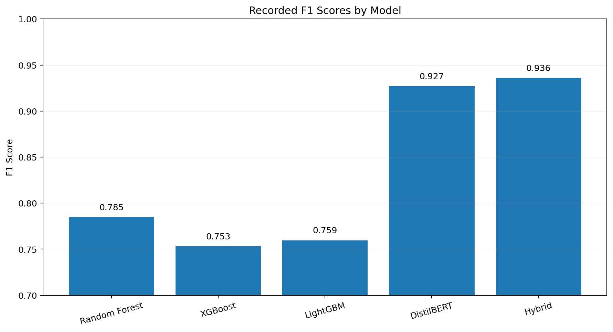
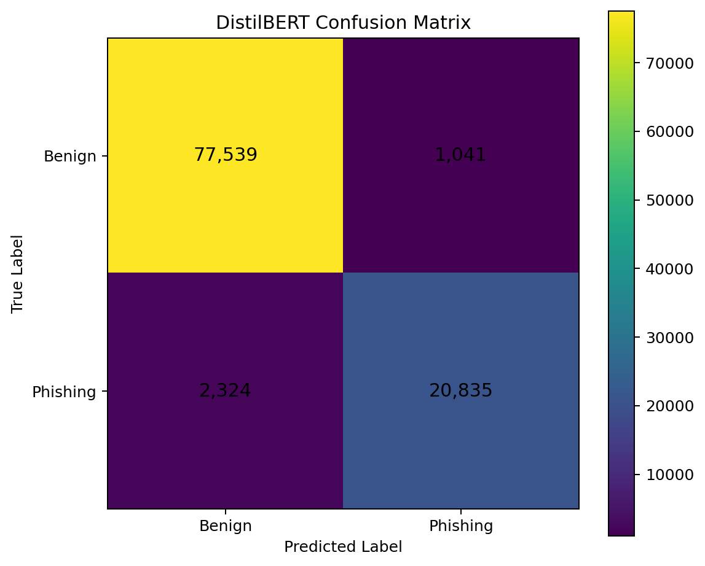

# Phishing URL Detection with Machine Learning and DistilBERT

A cybersecurity machine-learning project that compares classical URL-feature models, character-level text classification, transformer fine-tuning, and hybrid feature fusion for phishing URL detection.

The project was developed as an AI Security university project and focuses on the complete experimental pipeline: data preparation, leakage prevention, feature engineering, model training, evaluation, and error analysis.

## Project Highlights

* Compared classical machine-learning, NLP, transformer, and hybrid approaches.
* Processed more than 500,000 labeled URLs.
* Removed duplicate URLs before splitting the dataset.
* Checked for URL overlap between training and testing data.
* Evaluated models using accuracy, precision, recall, F1, MCC, ROC-AUC, and PR-AUC.
* Fine-tuned DistilBERT directly on URL strings.
* Combined engineered URL features with BERT-derived signals in a hybrid LightGBM model.
* Included notebooks for data exploration, model comparison, error analysis, and adversarial URL experiments.

## Project Ownership

This was an individual university project developed for an AI Security course.

I independently proposed the project idea and designed and implemented the complete experimental workflow. This included:

* selecting and comparing the machine-learning approaches;
* preparing and cleaning the datasets;
* implementing the engineered URL features;
* training Random Forest, XGBoost, and LightGBM models;
* implementing the character n-gram baseline;
* fine-tuning DistilBERT on URL strings;
* developing the hybrid LightGBM and BERT approach;
* evaluating and comparing the models;
* performing error analysis and adversarial URL experiments;
* creating the supporting scripts, notebooks, and documentation.

The URL datasets were obtained from publicly available sources. I did not create or manually collect the labeled URLs. The project idea, model selection, preprocessing, implementation, experimentation, evaluation, and documentation were completed independently.

This project was created as a practical student project and is not intended to represent a production-ready phishing detection system.

## Recorded Results

| Model                  |   Accuracy |   F1 Score |    ROC-AUC |     PR-AUC |
| ---------------------- | ---------: | ---------: | ---------: | ---------: |
| Random Forest          |     0.8857 |     0.7847 |     0.9350 |     0.8833 |
| XGBoost                |     0.8755 |     0.7530 |     0.9203 |     0.8663 |
| LightGBM               |     0.8779 |     0.7595 |     0.9240 |     0.8713 |
| DistilBERT             |     0.9602 |     0.9271 | **0.9919** | **0.9834** |
| Hybrid LightGBM + BERT | **0.9636** | **0.9359** |     0.9901 |     0.9814 |

The hybrid LightGBM and DistilBERT model achieved the highest recorded F1 score. DistilBERT achieved the highest recorded ROC-AUC and PR-AUC.

These values are historical results from the original project experiment. See [Model Comparison](results/published/model-comparison.md) for the methodology note and evaluation limitations.

## Visual Results

The following figures summarize results from the recorded project experiment.

### Model Comparison



The transformer-based models achieved substantially higher recorded F1 scores than the classical engineered-feature baselines.

### DistilBERT Error Analysis



The confusion matrix shows the distribution of correct predictions, false positives, and false negatives from the recorded DistilBERT evaluation run.

## Approaches

### Engineered URL Features

The classical models use structural and lexical URL features such as:

* URL length;
* number of digits and letters;
* number of dots, slashes, dashes, and special characters;
* path depth;
* approximate subdomain count;
* IP-address usage;
* suspicious URL keywords.

The following classifiers are evaluated:

* Random Forest;
* XGBoost;
* LightGBM.

### Character n-gram Classification

A character-level TF-IDF representation is combined with logistic regression.

This provides a lightweight text-classification baseline that can identify suspicious URL patterns without transformer inference.

### DistilBERT

DistilBERT is fine-tuned directly on URL strings for binary classification:

* `0`: benign URL;
* `1`: phishing URL.

The default configuration uses a reduced training sample and one epoch to remain practical on CPU-based systems. The sample size, batch size, learning rate, sequence length, and number of epochs can be adjusted in `src/train_bert.py`.

### Hybrid Feature Fusion

The hybrid model combines:

* engineered URL features;
* the DistilBERT phishing-class logit;
* the DistilBERT phishing probability.

A LightGBM classifier performs the final classification using the combined feature set.

## Repository Structure

```text
.
├── data/
│   ├── raw/                    # Downloaded source datasets, not tracked
│   └── processed/              # Generated splits and features, not tracked
├── notebooks/
│   ├── 1_data_exploration.ipynb
│   ├── 6_model_comparison.ipynb
│   ├── 7_error_analysis.ipynb
│   ├── 8_adversarial_urls.ipynb
│   └── 9_adversarial_urls.ipynb
├── results/
│   └── published/              # Curated results included in Git
├── scripts/
│   └── download_datasets.py
├── src/
│   ├── collect_results.py
│   ├── data_loading.py
│   ├── features.py
│   ├── run_all.py
│   ├── train_bert.py
│   ├── train_hybrid.py
│   ├── train_ml.py
│   └── train_ngrams.py
├── requirements.txt
└── README.md
```

## Installation

Python 3.11 is recommended.

Create and activate a Conda environment:

```bash
conda create --name phishing-env python=3.11 -y
conda activate phishing-env
```

Install the dependencies:

```bash
python -m pip install -r requirements.txt
```

Verify that the expected Python interpreter is active:


```bash
python -c "import sys; print(sys.executable)"
```

## Data Sources

The project uses publicly available URL datasets for training and evaluation:

* a labeled phishing URL dataset obtained from a public GitHub repository;
* the OpenPhish community feed as an additional source of phishing URLs.

The datasets were not created as part of this project. My work focused on the project concept, data preparation, feature engineering, model development, experimentation, evaluation, and analysis.

## Dataset Preparation

Download the required datasets:

```bash
python scripts/download_datasets.py
```

The script stores the source files under:

```text
data/raw/
```

Raw and processed datasets are intentionally excluded from Git because they are large generated or externally sourced files.

## Running the Pipeline

Run the complete experiment pipeline:

```bash
python src/run_all.py
```

Run the pipeline without DistilBERT:

```bash
python src/run_all.py --skip-bert
```

Run only the engineered-feature models:

```bash
python src/run_all.py --only-classical
```

Continue the pipeline when BERT training fails:

```bash
python src/run_all.py --allow-bert-fail
```

Use an existing BERT run for the hybrid model:

```bash
python src/run_all.py --skip-bert --include-hybrid
```

## Running Individual Stages

Prepare the train and test splits:

```bash
python src/data_loading.py
```

Generate engineered URL features:

```bash
python src/features.py
```

Train the classical models:

```bash
python src/train_ml.py
```

Train the character n-gram baseline:

```bash
python src/train_ngrams.py
```

Fine-tune DistilBERT:

```bash
python src/train_bert.py
```

Train the hybrid model:

```bash
python src/train_hybrid.py
```

Generate a consolidated result table:

```bash
python src/collect_results.py
```

## Generated Outputs

Generated metrics are written to:

```text
results/metrics/
```

Generated BERT checkpoints are written to timestamped directories:

```text
models/bert/run_YYYYMMDD_HHMMSS/
```

These generated artifacts are not intended to be committed to the repository.

Curated and documented experiment results are stored under:

```text
results/published/
```

## Reproducibility Measures

The project includes several controls intended to improve reproducibility:

* fixed random seed;
* stratified train/test split;
* duplicate removal before splitting;
* train/test URL-overlap check;
* explicit model parameters;
* saved metric metadata;
* timestamped BERT model directories;
* consolidated result generation.

Deep-learning results may still vary slightly across hardware, operating systems, CUDA versions, and PyTorch versions.

## Evaluation Limitations

The original experiment added an OpenPhish feed containing only phishing URLs to the internal test set.

This creates a useful phishing stress test, but combining it with the internal holdout set changes the class distribution and makes the overall score harder to interpret.

A revised evaluation should report separately:

1. performance on the internal stratified holdout set;
2. phishing recall on the external OpenPhish feed;
3. performance on a temporally separated benign and phishing dataset, where available.

Additional limitations include:

* URL-only classification cannot inspect webpage content, certificates, redirects, or domain-registration data;
* the primary dataset may contain historical patterns that differ from current phishing campaigns;
* DistilBERT was pretrained on natural language rather than specifically on URL syntax;
* the default BERT configuration prioritizes manageable runtime over exhaustive tuning;
* model predictions should not be treated as a replacement for layered browser, DNS, email, and endpoint security controls.

## Future Improvements

* Separate internal and external evaluation datasets.
* Introduce a validation set for threshold selection and hyperparameter tuning.
* Add automated tests for URL parsing and feature generation.
* Add GitHub Actions for linting and unit tests.
* Add command-line configuration for model parameters.
* Add a small inference command for testing individual URLs.
* Evaluate temporal generalization on newer phishing campaigns.
* Compare URL-specific transformer architectures.

## Responsible Use

This repository is intended for defensive security research and educational use.

The models may generate false positives and false negatives and should not be used as the sole mechanism for blocking or approving URLs in a production environment.

## Author

Moritz Bauer
Information Security / Cybersecurity
